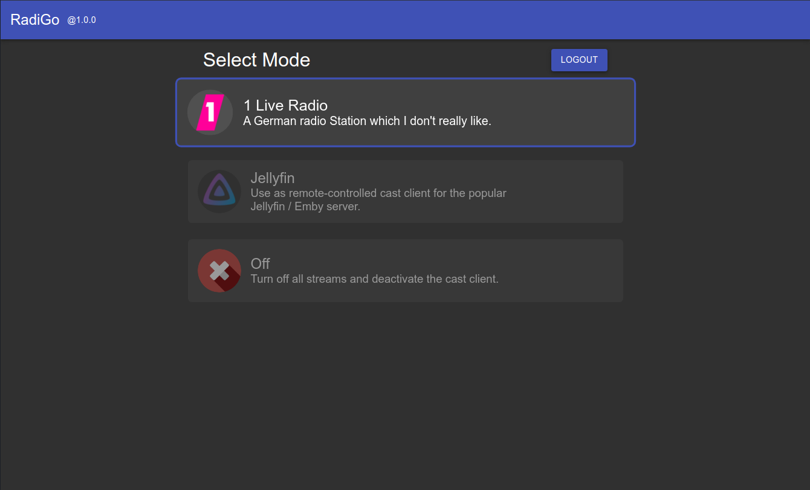
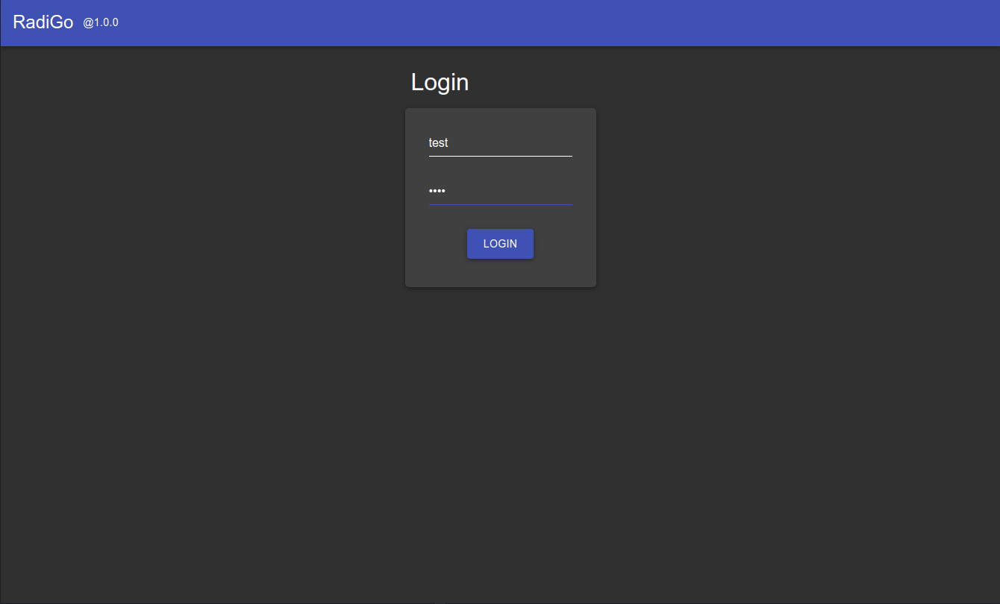
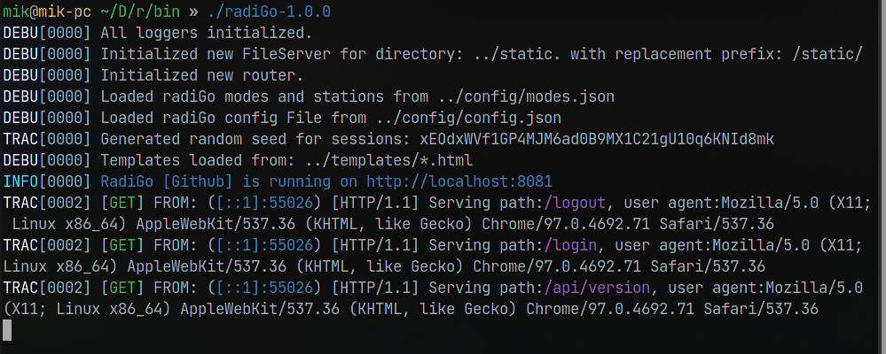

# RadiGo

## Version 1.0.0

  
Headless internet radio for linux

## Introduction

### What is it?

RadiGo allows you to turn your RaspberryPi or old PC into a headless internet-radio or remote-controlled speaker. The functionality of RadiGo is to send commands to that server using the sleek and modern webinterface.

### Why does it exist?

If your plan is to run a full media center than you might like [Jellyfin](https://github.com/jellyfin/). But if you are confused with setting up KODI on your server and using the webinterface than RadiGo might be just the right tool for the job.

I originally had the goal to create a DIY-internet radio that runs on my Raspberry Pi (Raspbian) and looked at KODI.
When it was time to add the internet-radio stations via KODI, I realized that I run Raspbian in headless mode which didn't allow me yo set up the stations.
Because staying headless (no display) was my goal, KODI was not a solution to my problem.

I also took a short look at [Volumio](https://volumio.com/) for the Raspberry Pi, but it is meant to be a standalone Operating System which din't meet my criteria either.

### Why you should use it

RadiGo is lightweight, offers streaming support for jellyfin and is compatible with almost every internet radio stream out there.
Due to RadiGo being written in Go, the application consist of a single binary for every common Linux architecture.
Note: for Jellyfin casting to work, install [Jellyfin MPV shim](https://github.com/jellyfin/jellyfin-mpv-shim/blob/master/README.md#linux-installation). If you are using it for the radio feature, install [MPV](https://mpv.io/manual/master/) on your host.
Other dependencies should be minimal, thanks to the binary, which contains all Go modules.

-> The Go toolchain / programming language is not required.

### Features

- Sleek and modern webinterface
- Mobile friendly
- Use your server as a Jellyfin cast client, for more information visit [this](https://github.com/jellyfin/jellyfin-mpv-shim#readme) website (Jellyfin MPV shim).
- Play **any** internet radio station on your server you like.

## Getting started

### Dependencies

Although RadiGo doesn't have many dependencies, [MPV](https://mpv.io/manual/master/) and [Jellyfin MPV shim](https://github.com/jellyfin/jellyfin-mpv-shim/blob/master/README.md#linux-installation) are required.

To install MPV on Raspbian / Debian Linux, execute following commands as root, or in this case using sudo.

```
sudo apt install libmpv1 mpv
```

if you type `mpv` in your terminal, then a similar output should be printed:

```
mik@mik-pc ~ > mpv
mpv 0.32.0 Copyright © 2000-2020 mpv/MPlayer/mplayer2 projects
 built on UNKNOWN
```

now that MPV is successfully installed, we will install Jellyfin MPV Shim

If you don't have PIP installed, use the command below.

```
sudo apt install python3-pip
```

Depending on your usecase, install jellyfin-mpv-shim with sudo

```
sudo pip3 install jellyfin-mpv-shim
```

```
pip3 install jellyfin-mpv-shim
```

### Installation

To get started, navigate to [the release section](https://github.com/MikMuellerDev/radiGo/releases)
of RadiGo.

https://github.com/MikMuellerDev/radiGo/releases

Depending on your host, your file should look something like `radiGo-1.0.0_linux_arm.tar.gz` this.

If your server is a modern PC less than 10 years old your architecture is most likely

`radiGo-1.0.0_linux_amd64.tar.gz`.

On a Raspberry Pi it is most likely `radiGo-1.0.0_linux_arm.tar.gz`, make sure the `linux_arm` part matches.
Download the [file](https://github.com/MikMuellerDev/radiGo/releases/download/v1.1.0/radiGo-1.0.0_linux_arm.tar.gz) and save it in a directory of your choosing.
Unpack the tar archive using

```
tar xvf radiGo-1.0.0_linux_arm.tar.gz
```

Make sure to replace your filename accordingly.

### Run

Once downloaded and unpacked, navigate to the extracted directory and then in the `bin` directory.  
Then run the file like follows `./radiGo-1.0.0_linux_arm.tar.gz`.
If everything worked flawlessly, you will see output in the console.

Now you can navigate to your instance `http://192.168.178.XXX:8081/`
The default credentials will be

`user: test`

`password: test`

### Setup

You can modify available stations in `config/modes.json`.

When using custom radio stations, place the thumbnails for them in `static/media/` or wherever your path inside `static/media/` (specified in `config/modes.json`) is.

The server can be modified by editing `config/config.json`

## Screenshots

### Dashboard



### Login Page



### Server Logs


